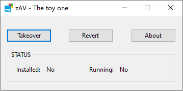

# zAV
The most straightforward  way to shut down **Windows Defender** legally.

### Ⅰ. How it works.

By leveraging some components of [Hurong Security (huorong.cn)](https://www.huorong.cn/) antivirus, which allows us to register it as a legal and valid antivirus software to the **Windows security center** without needing to install the **Hurong Security Suite** at all, and then Windows Defender will shut down itself automatically.

### Ⅱ. How to build.

+ Pre-requirements

  + Visual studio 2019+
  + Vcpkg

+ Install **WTL** through vcpkg

  > vcpkg install WTL:x64-windows-static
  >
  > vcpkg install WTL:x86-windows-static

+ Open `app/zAV.vcxproj`.

+ Just compile it now.

### Ⅲ. Notes

+ This's a research project, use it at your own risk.

  > I highly recommend you to install a serious antivirus product such as Hurong, ESET, and so on.

+ For legal reasons, I'll not publish any package containing third-party components.

